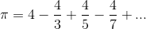

## [Problem 1](1/1.cpp)
> 编写一个程序，利用下面的公式计算e^x的值，要求精确到10^-10。

 
## [Problem 2](2/2.cpp)
> 编写一个程序，利用下面的公式计算pi的值，要求小数点后的位数为计算机可表达的最大范围。

## [Problem 3](3/3.cpp) 
> 编写一个递归函数模板，从一个数组中找出最小值，并返回该值的数组下标元素。
## [Problem 4](4/4.cpp)
> 编写两个函数SortOne和SortTwo分别对字符串数组实现插入排序和选择排序。
## Problem 5 [main函数](5/5.cpp)|[Array.h](5/Array.h)
> 自定义数组Array的operator()访问，对于一个数组 Array 类的 chess 对象通过调用运算符重载函数()，实现 chess(row,column)代替 chess[row][column]。 
> 请完成: 
> （1）Array 类的基本定义，包括构造函数、析构函数、拷贝构造函数和基本数据成员; 
> （2）运算符重载函数()的定义。
## Problem 6
## [main函数](6/6.cpp)|[Shape.h](6/Shape.h)|[Point.h](6/Point.h)|[Circle.h](6/Circle.h)|[Rec.h](6/Rec.h)|[Tri.h](6/Tri.h)
> 定义一个具有多态性的基类Shape，派生出三个类：圆 Circle 类(圆心坐标和半径)，矩形 Rec 类(对角线两点不同坐标)，三角形 Tri 类(三个不同坐标)，每个类中至少有一个计算面积的函数。编写程序，从文件 [file.txt](6/file.txt) 中读取数据来创建各类的对象，并放在 Shape 指针向量中，最后循环处理每个对象并输出面积。

题目参考自：https://blog.csdn.net/qq_32925781/article/details/79389350