# 一、简答题
## 1. 什么是逻辑错误？什么是语法错误？请举例说明。
答：


在编程中，语法错误和逻辑错误是两种完全不同类型的错误，它们发生在开发过程的不同阶段，具有不同的特征和调试难度。

### 1. 语法错误

#### 1.1 定义与特征
**语法错误**是指代码不符合编程语言的语法规则。这类错误在编译阶段就会被发现，程序无法成功编译和运行。

**主要特征：**
- 编译器会报错并停止编译
- 错误信息通常明确指出问题位置
- 必须修复后才能运行程序
- 相对容易发现和修复

#### 1.2 常见语法错误类型及示例

##### 1.2.1 缺少分号
```cpp
#include <iostream>

int main() {
    int x = 5
    std::cout << x << std::endl  // 错误：缺少分号
    return 0
}  // 错误：缺少分号
```

**编译器错误信息：**
```
error: expected ';' after expression
```

##### 1.2.2 括号不匹配
```cpp
#include <iostream>

int main() {
    int result = (5 + 3 * (2 - 1);  // 错误：缺少闭合括号
    std::cout << result;
    return 0;
}
```

**编译器错误信息：**
```
error: expected ')'
```

##### 1.2.3 未声明的标识符
```cpp
#include <iostream>

int main() {
    int number = 10;
    std::cout << numer << std::endl;  // 错误：变量名拼写错误
    return 0;
}
```

**编译器错误信息：**
```
error: use of undeclared identifier 'numer'
```

##### 1.2.4 类型不匹配
```cpp
#include <iostream>

int main() {
    int* ptr = 5;  // 错误：不能将int直接赋给int*
    std::string str = 123;  // 错误：不能将int直接赋给std::string
    return 0;
}
```

**编译器错误信息：**
```
error: cannot initialize a variable of type 'int *' with an rvalue of type 'int'
error: no viable conversion from 'int' to 'std::string'
```

##### 1.2.5 函数声明/定义错误
```cpp
#include <iostream>

// 错误：函数声明缺少参数类型
int add(a, b) {
    return a + b;
}

int main() {
    std::cout << add(5, 3) << std::endl;
    return 0;
}
```

**编译器错误信息：**
```
error: use of undeclared identifier 'a'
error: use of undeclared identifier 'b'
```

### 2. 逻辑错误

#### 2.1 定义与特征
**逻辑错误**是指代码语法正确，可以编译和运行，但程序的行为不符合预期或产生错误的结果。这类错误源于程序员的逻辑设计缺陷。

**主要特征：**
- 程序可以正常编译和运行
- 不产生编译器错误信息
- 运行时行为异常或结果错误
- 难以发现和调试
- 需要仔细分析代码逻辑

#### 2.2 常见逻辑错误类型及示例

##### 2.2.1 算法逻辑错误
```cpp
#include <iostream>

// 意图：计算1到n的和
int sumToN(int n) {
    int sum = 0;
    for (int i = 1; i < n; i++) {  // 逻辑错误：应该是 i <= n
        sum += i;
    }
    return sum;
}

int main() {
    std::cout << "Sum 1 to 5: " << sumToN(5) << std::endl;
    // 输出：10（错误，应该是15）
    return 0;
}
```

**问题分析：** 循环条件应该是 `i <= n` 而不是 `i < n`，导致少加了一次n。

##### 2.2.2 边界条件错误
```cpp
#include <iostream>
#include <vector>

// 意图：在vector中查找元素
int findIndex(const std::vector<int>& vec, int target) {
    for (int i = 0; i <= vec.size(); i++) {  // 逻辑错误：应该是 i < vec.size()
        if (vec[i] == target) {
            return i;
        }
    }
    return -1;
}

int main() {
    std::vector<int> numbers = {1, 2, 3, 4, 5};
    int index = findIndex(numbers, 3);
    std::cout << "Index: " << index << std::endl;
    // 可能产生数组越界访问，未定义行为
    return 0;
}
```

**问题分析：** 循环条件错误导致访问 `vec[vec.size()]`，这是未定义行为。

##### 2.2.3 条件判断错误
```cpp
#include <iostream>

// 意图：判断年份是否为闰年
bool isLeapYear(int year) {
    // 逻辑错误：条件组合错误
    if (year % 4 == 0) {
        return true;
    } else if (year % 100 == 0) {
        return false;
    } else if (year % 400 == 0) {
        return true;
    }
    return false;
}

int main() {
    std::cout << "2000 is leap year: " << isLeapYear(2000) << std::endl;
    // 输出：false（错误，2000是闰年）
    std::cout << "1900 is leap year: " << isLeapYear(1900) << std::endl;
    // 输出：false（正确）
    return 0;
}
```

**正确实现：**
```cpp
bool isLeapYearCorrect(int year) {
    return (year % 4 == 0 && year % 100 != 0) || (year % 400 == 0);
}
```

##### 2.2.4 浮点数比较错误
```cpp
#include <iostream>
#include <cmath>

// 意图：比较两个浮点数是否相等
bool areEqual(double a, double b) {
    return a == b;  // 逻辑错误：浮点数不应该直接比较相等
}

int main() {
    double result = 0.1 + 0.2;
    std::cout << "0.1 + 0.2 == 0.3: " << areEqual(result, 0.3) << std::endl;
    // 输出：false（由于浮点数精度问题）
    return 0;
}
```

**正确实现：**
```cpp
bool areEqualCorrect(double a, double b, double epsilon = 1e-9) {
    return std::fabs(a - b) < epsilon;
}
```

##### 2.2.5 资源管理错误
```cpp
#include <iostream>
#include <memory>

class Resource {
public:
    Resource() { std::cout << "Resource acquired\n"; }
    ~Resource() { std::cout << "Resource released\n"; }
    void use() { std::cout << "Using resource\n"; }
};

// 意图：管理资源，但有逻辑错误
void problematicResourceManagement() {
    Resource* res = new Resource();
    res->use();
    
    // 逻辑错误：在某些条件下可能忘记delete
    if (/* 某些条件 */ true) {
        return;  // 提前返回，导致内存泄漏
    }
    
    delete res;  // 这行代码不会执行
}

int main() {
    problematicResourceManagement();
    // 输出：Resource acquired
    // 没有"Resource released"，内存泄漏！
    return 0;
}
```

**正确实现（使用智能指针）：**
```cpp
void correctResourceManagement() {
    auto res = std::make_unique<Resource>();
    res->use();
    // 无论何时返回，资源都会被自动释放
}
```

##### 2.2.6 并发访问错误
```cpp
#include <iostream>
#include <vector>
#include <thread>

std::vector<int> data;
int sharedCounter = 0;

// 意图：多线程填充数据
void fillData(int start, int count) {
    for (int i = start; i < start + count; i++) {
        data.push_back(i);  // 逻辑错误：非线程安全
        sharedCounter++;    // 逻辑错误：非原子操作
    }
}

int main() {
    std::thread t1(fillData, 0, 1000);
    std::thread t2(fillData, 1000, 1000);
    
    t1.join();
    t2.join();
    
    std::cout << "Data size: " << data.size() << std::endl;
    std::cout << "Counter: " << sharedCounter << std::endl;
    // 结果可能不符合预期，存在数据竞争
    return 0;
}
```

### 3. 对比总结

| 特征 | 语法错误 | 逻辑错误 |
|------|----------|----------|
| **发现时机** | 编译时 | 运行时 |
| **编译器反应** | 报错并停止编译 | 无错误信息，正常编译 |
| **调试难度** | 容易（编译器指出位置） | 困难（需要分析程序行为） |
| **影响** | 程序无法运行 | 程序运行但结果错误 |
| **示例** | 缺少分号、括号 | 算法错误、边界条件错误 |
| **修复方法** | 修正语法 | 重新设计逻辑 |

### 4. 实际调试示例

#### 4.1 识别和修复逻辑错误
```cpp
#include <iostream>
#include <vector>

// 有逻辑错误的函数：意图是找出数组中的最大值
int findMax(const std::vector<int>& arr) {
    if (arr.empty()) return -1;
    
    int max = 0;  // 逻辑错误：如果数组全是负数会返回0
    for (int num : arr) {
        if (num > max) {
            max = num;
        }
    }
    return max;
}

// 测试用例
void testFindMax() {
    std::vector<int> positive = {1, 5, 3, 9, 2};
    std::vector<int> negative = {-5, -2, -8, -1};
    std::vector<int> mixed = {-3, 0, 7, -2, 4};
    
    std::cout << "Positive max: " << findMax(positive) << std::endl;  // 9 ✓
    std::cout << "Negative max: " << findMax(negative) << std::endl;  // 0 ✗（应该是-1）
    std::cout << "Mixed max: " << findMax(mixed) << std::endl;        // 7 ✓
}

// 修复后的版本
int findMaxCorrect(const std::vector<int>& arr) {
    if (arr.empty()) return -1;
    
    int max = arr[0];  // 用第一个元素初始化
    for (int num : arr) {
        if (num > max) {
            max = num;
        }
    }
    return max;
}
```

### 5. 预防和调试策略

#### 5.1 预防语法错误
- 使用现代IDE（语法高亮、实时检查）
- 遵循编码规范
- 定期编译检查

#### 5.2 预防和发现逻辑错误
- 编写单元测试
- 使用断言（assertions）
- 代码审查
- 静态分析工具
- 充分的测试用例（包括边界情况）
- 调试器和日志输出

```cpp
#include <cassert>

void testLogic() {
    // 使用断言检查假设
    std::vector<int> test = {-5, -2, -8, -1};
    int result = findMaxCorrect(test);
    assert(result == -1);  // 如果断言失败，程序会终止
    
    // 添加日志帮助调试
    std::cout << "Test passed: max of negatives is " << result << std::endl;
}
```

### 6. 总结

**语法错误**是"说错话" - 违反了语言的基本规则，编译器能够立即发现。

**逻辑错误**是"说错事" - 语法正确但意思不对，需要人工分析和测试来发现。

理解这两种错误的区别对于提高编程效率和代码质量至关重要。语法错误通常容易修复，而逻辑错误往往需要更深入的调试和分析技能。


## 2. 控制语句有哪几种？请画出它的流程图或UML图。
答：


控制语句是编程中用于控制程序执行流程的关键结构。以下是主要的控制语句类型及其流程图表示。

### 1. 顺序结构

#### 描述
程序按代码书写顺序依次执行，是最基本的控制结构。

#### 流程图
```
┌─────────┐
│ 开始     │
├─────────┤
│ 语句1    │
├─────────┤
│ 语句2    │
├─────────┤
│ 语句3    │
├─────────┤
│ 结束     │
└─────────┘
```

### 2. 条件分支结构

#### 2.1 if 语句

##### 语法
```cpp
if (条件) {
    // 条件为真时执行的代码
}
```

##### 流程图
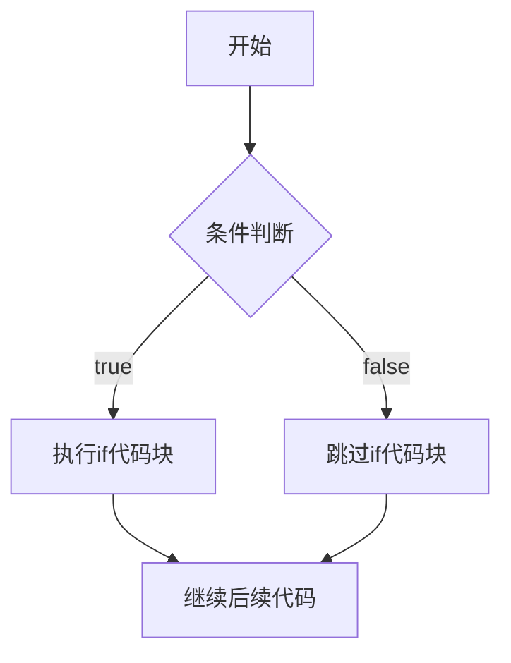

#### 2.2 if-else 语句

##### 语法
```cpp
if (条件) {
    // 条件为真时执行
} else {
    // 条件为假时执行
}
```

##### 流程图
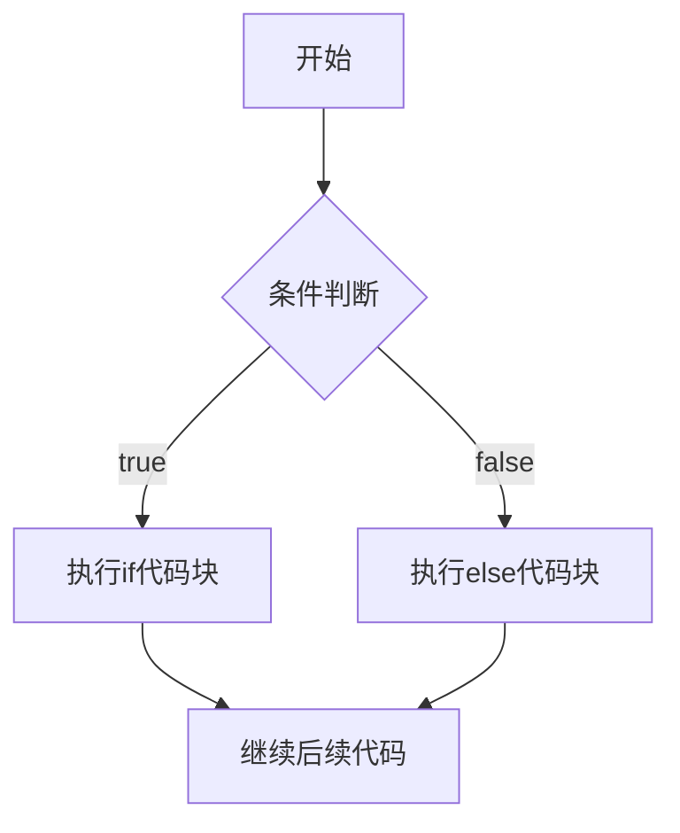

#### 2.3 if-else if-else 语句

##### 语法
```cpp
if (条件1) {
    // 条件1为真时执行
} else if (条件2) {
    // 条件2为真时执行
} else {
    // 所有条件都为假时执行
}
```

##### 流程图
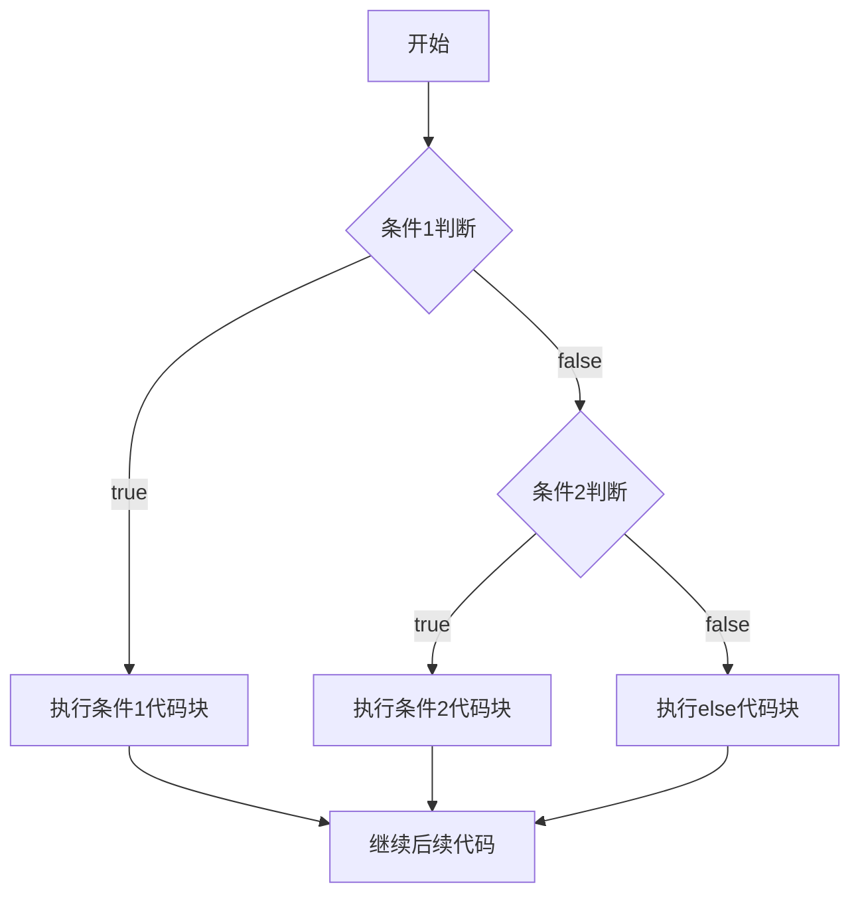

#### 2.4 switch 语句

##### 语法
```cpp
switch (表达式) {
    case 值1:
        // 代码块1
        break;
    case 值2:
        // 代码块2
        break;
    default:
        // 默认代码块
}
```

##### 流程图
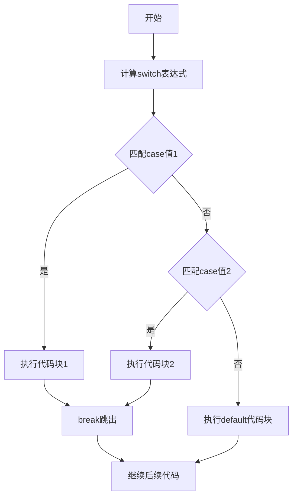

### 3. 循环结构

#### 3.1 for 循环

##### 语法
```cpp
for (初始化; 条件; 更新) {
    // 循环体
}
```

##### 流程图
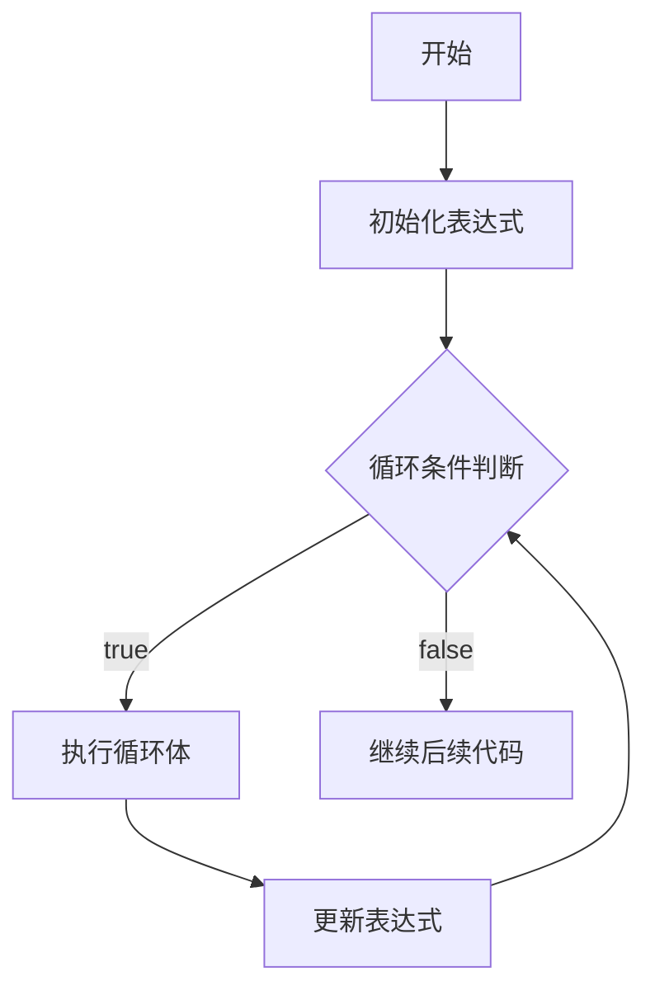

#### 3.2 while 循环

##### 语法
```cpp
while (条件) {
    // 循环体
}
```

##### 流程图
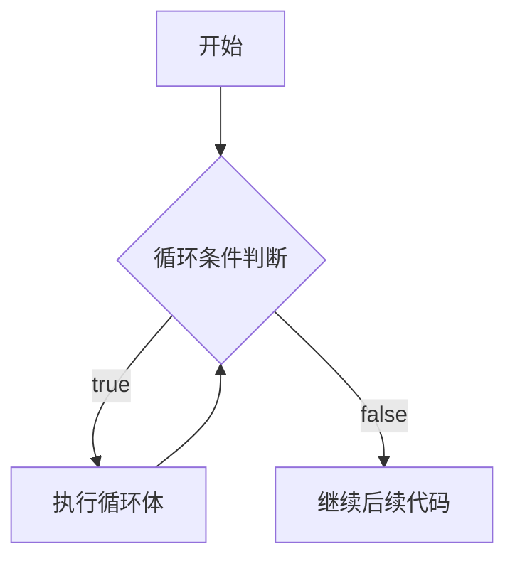

#### 3.3 do-while 循环

##### 语法
```cpp
do {
    // 循环体
} while (条件);
```

##### 流程图
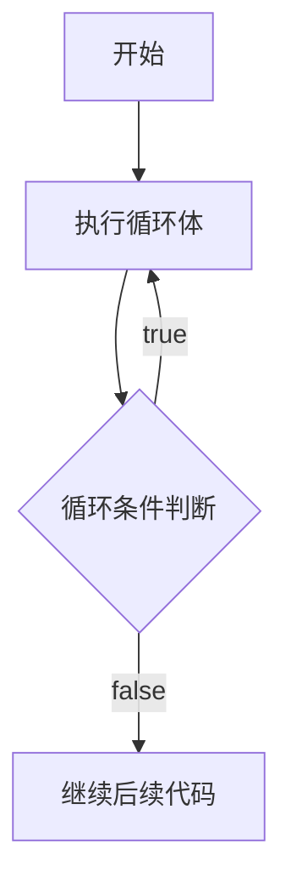

### 4. 跳转结构

#### 4.1 break 语句

##### 作用
立即退出当前循环或switch语句。

##### 流程图（在循环中）
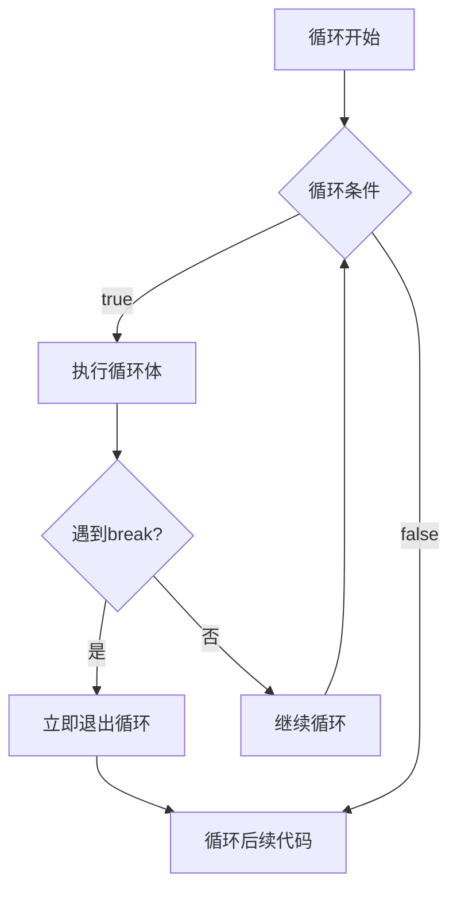

#### 4.2 continue 语句

##### 作用
跳过当前循环的剩余部分，直接开始下一次循环。

##### 流程图
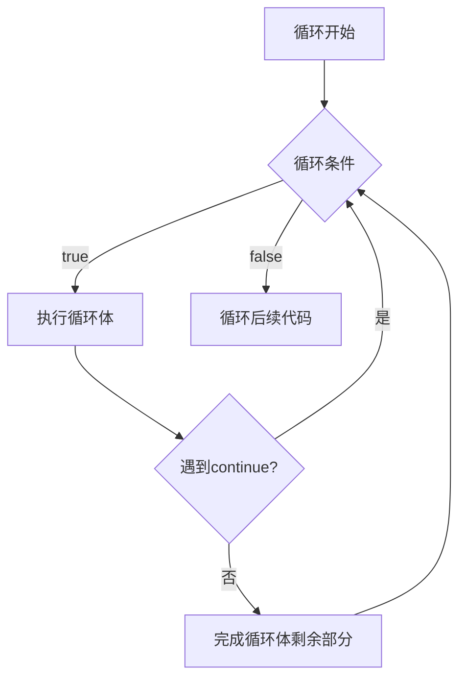

#### 4.3 return 语句

##### 作用
从函数中返回，可带返回值。

##### 流程图
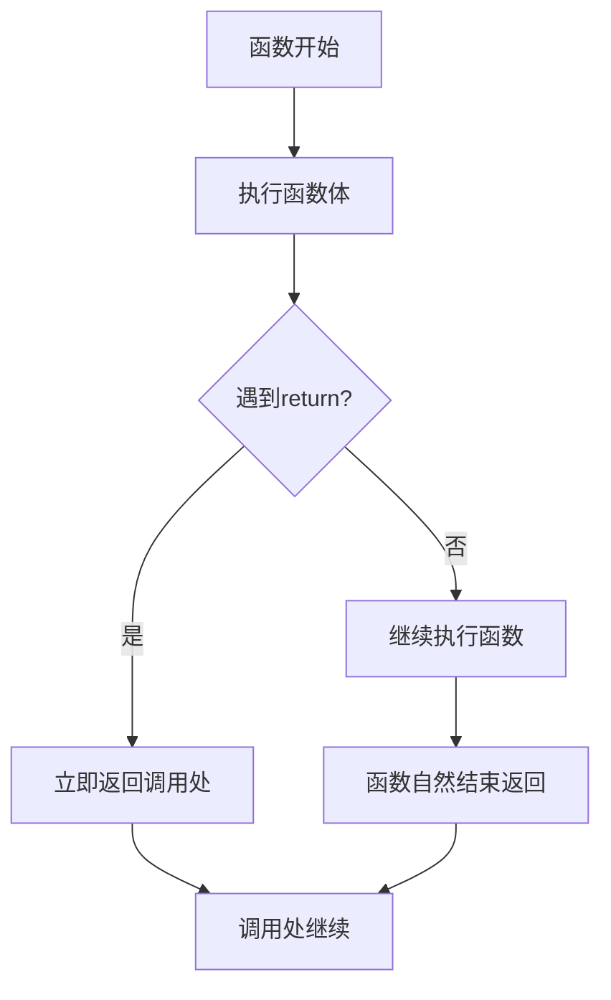

#### 4.4 goto 语句

##### 语法
```cpp
goto label;
// ...
label:
// 代码
```

##### 流程图
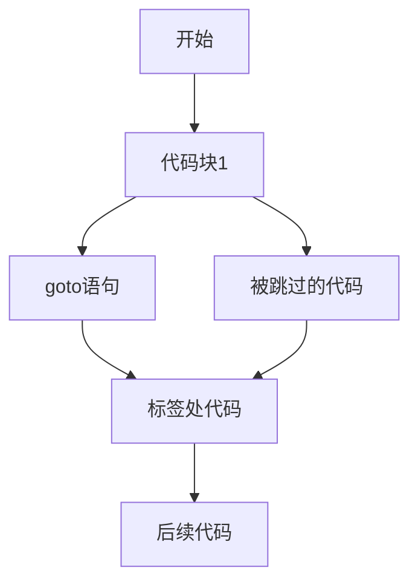

### 5. 异常处理结构

#### 5.1 try-catch 语句

##### 语法
```cpp
try {
    // 可能抛出异常的代码
} catch (异常类型1& e) {
    // 处理异常类型1
} catch (异常类型2& e) {
    // 处理异常类型2
}
```

##### 流程图
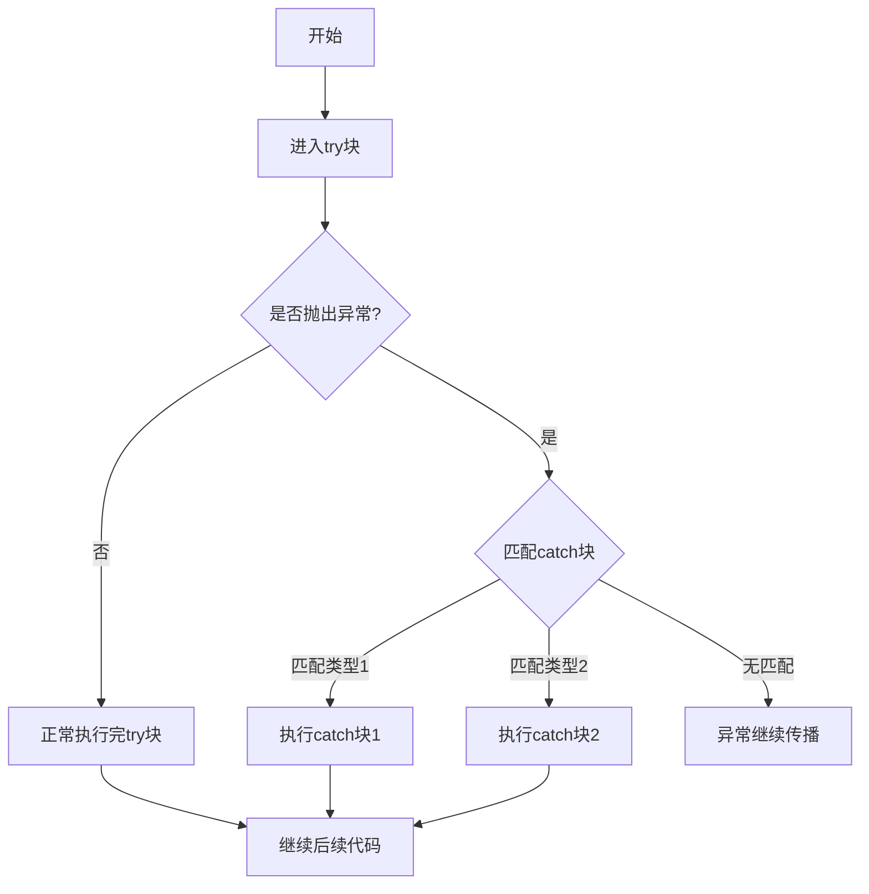

### 6. 综合控制结构示例

#### 完整程序流程示例
```cpp
#include <iostream>
using namespace std;

int main() {
    // 顺序结构
    cout << "程序开始" << endl;
    
    // 循环结构 + 条件分支
    for (int i = 1; i <= 10; i++) {
        // 条件分支
        if (i % 2 == 0) {
            cout << i << "是偶数" << endl;
        } else {
            cout << i << "是奇数" << endl;
        }
        
        // 跳转结构
        if (i == 5) {
            cout << "跳到循环结束" << endl;
            break;  // 跳出循环
        }
    }
    
    // 顺序结构
    cout << "程序结束" << endl;
    return 0;
}
```

#### 对应的综合流程图
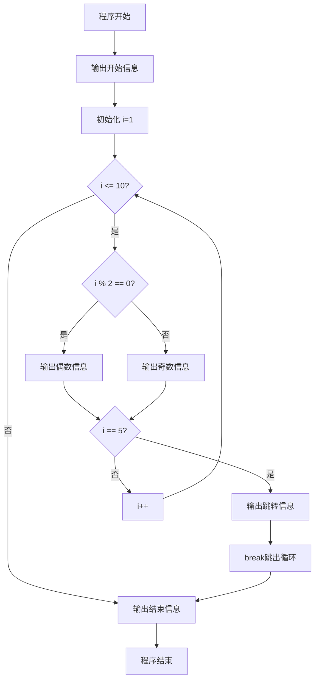

### 7. UML 状态图表示控制流程

#### 程序执行状态图
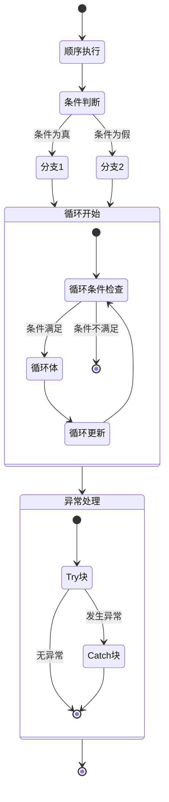

### 总结

控制语句是编程语言的基石，主要包括：

1. **顺序结构** - 默认执行流程
2. **条件分支** - if, if-else, switch
3. **循环结构** - for, while, do-while
4. **跳转结构** - break, continue, return, goto
5. **异常处理** - try-catch

理解这些控制结构的流程图有助于：
- 更好地设计和分析算法
- 调试程序逻辑错误
- 编写更清晰、可维护的代码
- 预测程序执行路径

每种控制结构都有其特定的应用场景，在实际编程中需要根据具体需求选择合适的结构组合。


## 3. 什么是运算符重载？它如何增强了C++的拓展性？
答：


### 1. 运算符重载的基本概念

#### 1.1 定义
**运算符重载**是C++中的一种多态特性，允许程序员为自定义类型重新定义已有的运算符行为。它使得运算符能够用于用户定义的类型，就像用于内置类型一样。

#### 1.2 基本语法
```cpp
返回类型 operator运算符符号(参数列表) {
    // 运算符的实现
}
```

### 2. 运算符重载的具体实现

#### 2.1 基本运算符重载示例

##### 2.1.1 复数类的运算符重载
```cpp
#include <iostream>

class Complex {
private:
    double real;
    double imag;
    
public:
    Complex(double r = 0.0, double i = 0.0) : real(r), imag(i) {}
    
    // 重载 + 运算符（成员函数方式）
    Complex operator+(const Complex& other) const {
        return Complex(real + other.real, imag + other.imag);
    }
    
    // 重载 - 运算符
    Complex operator-(const Complex& other) const {
        return Complex(real - other.real, imag - other.imag);
    }
    
    // 重载 * 运算符
    Complex operator*(const Complex& other) const {
        return Complex(real * other.real - imag * other.imag,
                      real * other.imag + imag * other.real);
    }
    
    // 重载 == 运算符
    bool operator==(const Complex& other) const {
        return real == other.real && imag == other.imag;
    }
    
    // 重载 << 运算符（友元函数）
    friend std::ostream& operator<<(std::ostream& os, const Complex& c);
    
    // 重载 >> 运算符（友元函数）
    friend std::istream& operator>>(std::istream& is, Complex& c);
};

// 重载输出运算符
std::ostream& operator<<(std::ostream& os, const Complex& c) {
    os << "(" << c.real << " + " << c.imag << "i)";
    return os;
}

// 重载输入运算符
std::istream& operator>>(std::istream& is, Complex& c) {
    std::cout << "Enter real part: ";
    is >> c.real;
    std::cout << "Enter imaginary part: ";
    is >> c.imag;
    return is;
}

void complex_example() {
    Complex c1(3.0, 4.0);
    Complex c2(1.0, 2.0);
    
    Complex sum = c1 + c2;        // 使用重载的 + 运算符
    Complex product = c1 * c2;    // 使用重载的 * 运算符
    
    std::cout << "c1 = " << c1 << std::endl;
    std::cout << "c2 = " << c2 << std::endl;
    std::cout << "Sum: " << sum << std::endl;
    std::cout << "Product: " << product << std::endl;
    
    if (c1 == c2) {
        std::cout << "c1 equals c2" << std::endl;
    } else {
        std::cout << "c1 does not equal c2" << std::endl;
    }
}
```

##### 2.1.2 字符串类的运算符重载
```cpp
#include <cstring>

class MyString {
private:
    char* data;
    size_t length;
    
    void copyString(const char* str) {
        if (str) {
            length = strlen(str);
            data = new char[length + 1];
            strcpy(data, str);
        } else {
            data = nullptr;
            length = 0;
        }
    }
    
public:
    // 构造函数
    MyString(const char* str = nullptr) {
        copyString(str);
    }
    
    // 拷贝构造函数
    MyString(const MyString& other) {
        copyString(other.data);
    }
    
    // 析构函数
    ~MyString() {
        delete[] data;
    }
    
    // 重载 = 运算符
    MyString& operator=(const MyString& other) {
        if (this != &other) {
            delete[] data;
            copyString(other.data);
        }
        return *this;
    }
    
    // 重载 + 运算符（字符串拼接）
    MyString operator+(const MyString& other) const {
        char* newData = new char[length + other.length + 1];
        strcpy(newData, data);
        strcat(newData, other.data);
        MyString result(newData);
        delete[] newData;
        return result;
    }
    
    // 重载 += 运算符
    MyString& operator+=(const MyString& other) {
        *this = *this + other;
        return *this;
    }
    
    // 重载 [] 运算符
    char& operator[](size_t index) {
        return data[index];
    }
    
    const char& operator[](size_t index) const {
        return data[index];
    }
    
    // 重载 == 运算符
    bool operator==(const MyString& other) const {
        return strcmp(data, other.data) == 0;
    }
    
    // 重载 << 运算符
    friend std::ostream& operator<<(std::ostream& os, const MyString& str);
};

std::ostream& operator<<(std::ostream& os, const MyString& str) {
    if (str.data) {
        os << str.data;
    }
    return os;
}
```

### 3. 运算符重载如何增强C++的扩展性

#### 3.1 使自定义类型具有内置类型的行为

```cpp
// 数学向量类展示扩展性
class Vector3D {
private:
    double x, y, z;
    
public:
    Vector3D(double x = 0, double y = 0, double z = 0) : x(x), y(y), z(z) {}
    
    // 重载算术运算符
    Vector3D operator+(const Vector3D& other) const {
        return Vector3D(x + other.x, y + other.y, z + other.z);
    }
    
    Vector3D operator-(const Vector3D& other) const {
        return Vector3D(x - other.x, y - other.y, z - other.z);
    }
    
    // 重载标量乘法
    Vector3D operator*(double scalar) const {
        return Vector3D(x * scalar, y * scalar, z * scalar);
    }
    
    // 友元函数实现左乘
    friend Vector3D operator*(double scalar, const Vector3D& vec);
    
    // 重载复合赋值运算符
    Vector3D& operator+=(const Vector3D& other) {
        x += other.x;
        y += other.y;
        z += other.z;
        return *this;
    }
    
    // 重载比较运算符
    bool operator==(const Vector3D& other) const {
        return x == other.x && y == other.y && z == other.z;
    }
    
    // 重载函数调用运算符 - 使对象可调用
    double operator()(int index) const {
        switch(index) {
            case 0: return x;
            case 1: return y;
            case 2: return z;
            default: throw std::out_of_range("Invalid index");
        }
    }
    
    // 重载类型转换运算符
    explicit operator bool() const {
        return x != 0 || y != 0 || z != 0;  // 非零向量为true
    }
    
    friend std::ostream& operator<<(std::ostream& os, const Vector3D& vec);
};

// 左乘标量的友元函数
Vector3D operator*(double scalar, const Vector3D& vec) {
    return vec * scalar;
}

std::ostream& operator<<(std::ostream& os, const Vector3D& vec) {
    os << "(" << vec.x << ", " << vec.y << ", " << vec.z << ")";
    return os;
}

void vector_example() {
    Vector3D v1(1, 2, 3);
    Vector3D v2(4, 5, 6);
    
    // 自然数学表达式
    Vector3D v3 = v1 + v2;
    Vector3D v4 = 2.5 * v1;
    Vector3D v5 = v2 * 3.0;
    
    v1 += v2;  // 复合赋值
    
    std::cout << "v1: " << v1 << std::endl;
    std::cout << "v2: " << v2 << std::endl;
    std::cout << "v3: " << v3 << std::endl;
    std::cout << "v4: " << v4 << std::endl;
    
    // 使用函数调用运算符
    std::cout << "v1 x-component: " << v1(0) << std::endl;
    
    // 使用bool转换
    if (v1) {
        std::cout << "v1 is non-zero vector" << std::endl;
    }
}
```

#### 3.2 与STL算法的无缝集成

```cpp
#include <algorithm>
#include <vector>
#include <set>

class Point {
private:
    int x, y;
    
public:
    Point(int x = 0, int y = 0) : x(x), y(y) {}
    
    // 重载 < 运算符用于STL排序和集合
    bool operator<(const Point& other) const {
        if (x == other.x) {
            return y < other.y;
        }
        return x < other.x;
    }
    
    // 重载 == 运算符用于查找算法
    bool operator==(const Point& other) const {
        return x == other.x && y == other.y;
    }
    
    friend std::ostream& operator<<(std::ostream& os, const Point& p);
};

std::ostream& operator<<(std::ostream& os, const Point& p) {
    os << "(" << p.x << ", " << p.y << ")";
    return os;
}

void stl_integration_example() {
    std::vector<Point> points = {
        Point(3, 4), Point(1, 2), Point(5, 1), Point(2, 3)
    };
    
    // 使用STL排序 - 需要 operator<
    std::sort(points.begin(), points.end());
    
    std::cout << "Sorted points: ";
    for (const auto& p : points) {
        std::cout << p << " ";
    }
    std::cout << std::endl;
    
    // 使用STL查找 - 需要 operator==
    auto it = std::find(points.begin(), points.end(), Point(2, 3));
    if (it != points.end()) {
        std::cout << "Found: " << *it << std::endl;
    }
    
    // 使用STL集合 - 需要 operator<
    std::set<Point> pointSet;
    pointSet.insert(Point(1, 1));
    pointSet.insert(Point(2, 2));
    pointSet.insert(Point(1, 1));  // 重复，不会插入
    
    std::cout << "Point set size: " << pointSet.size() << std::endl;
}
```

#### 3.3 实现智能指针和资源管理

```cpp
#include <iostream>

template<typename T>
class SmartPointer {
private:
    T* ptr;
    
public:
    explicit SmartPointer(T* p = nullptr) : ptr(p) {}
    
    ~SmartPointer() {
        delete ptr;
    }
    
    // 重载 * 运算符
    T& operator*() const {
        return *ptr;
    }
    
    // 重载 -> 运算符
    T* operator->() const {
        return ptr;
    }
    
    // 重载 bool 转换运算符
    explicit operator bool() const {
        return ptr != nullptr;
    }
    
    // 禁止拷贝
    SmartPointer(const SmartPointer&) = delete;
    SmartPointer& operator=(const SmartPointer&) = delete;
    
    // 允许移动
    SmartPointer(SmartPointer&& other) noexcept : ptr(other.ptr) {
        other.ptr = nullptr;
    }
    
    SmartPointer& operator=(SmartPointer&& other) noexcept {
        if (this != &other) {
            delete ptr;
            ptr = other.ptr;
            other.ptr = nullptr;
        }
        return *this;
    }
};

class Resource {
public:
    void use() {
        std::cout << "Using resource" << std::endl;
    }
    
    void printInfo() {
        std::cout << "Resource info" << std::endl;
    }
};

void smart_pointer_example() {
    SmartPointer<Resource> sp(new Resource());
    
    // 使用重载的运算符，就像使用原始指针一样
    if (sp) {           // 使用 operator bool
        sp->use();      // 使用 operator->
        (*sp).printInfo(); // 使用 operator*
    }
}
```

### 4. 运算符重载的扩展性优势总结

#### 4.1 语法一致性
```cpp
// 内置类型
int a = 5, b = 3;
int c = a + b;

// 自定义类型 - 相同的语法
Complex c1(1, 2), c2(3, 4);
Complex c3 = c1 + c2;  // 语法一致，易于理解
```

#### 4.2 领域特定语言（DSL）支持
```cpp
// 数学表达式DSL
class Matrix {
    // ... 矩阵实现
public:
    Matrix operator+(const Matrix& other) const;
    Matrix operator*(const Matrix& other) const;
    
    // 支持自然数学表达式：A * B + C
};

// 金融计算DSL
class Money {
    // ... 货币实现
public:
    Money operator+(const Money& other) const;
    Money operator*(double rate) const;
    
    // 支持自然金融计算：principal * interestRate + fee
};
```

#### 4.3 库设计和框架集成
```cpp
// 自定义迭代器
template<typename T>
class ListIterator {
    // ... 迭代器实现
public:
    T& operator*();           // 解引用
    ListIterator& operator++(); // 前缀递增
    bool operator!=(const ListIterator& other) const;
    
    // 可以与STL算法无缝配合
};

// 使用自定义迭代器与STL
std::vector<int> stdVec = {1, 2, 3};
MyCustomList<int> myList = {1, 2, 3};

// 相同的算法，不同的容器
std::sort(stdVec.begin(), stdVec.end());
std::sort(myList.begin(), myList.end());  // 需要重载的运算符支持
```

### 5. 运算符重载的最佳实践

#### 5.1 保持语义一致性
```cpp
class Rational {
private:
    int numerator, denominator;
    
public:
    // 好的重载：符合数学直觉
    Rational operator+(const Rational& other) const {
        // 实现有理数加法
    }
    
    // 避免奇怪的重载：不要改变运算符的常规含义
    // Rational operator+(const std::string& str) const; // 不好的设计
};
```

#### 5.2 提供完整的运算符集合
```cpp
class CompleteNumber {
public:
    // 提供相关运算符的完整集合
    CompleteNumber operator+(const CompleteNumber&) const;
    CompleteNumber operator-(const CompleteNumber&) const;
    CompleteNumber& operator+=(const CompleteNumber&);
    CompleteNumber& operator-=(const CompleteNumber&);
    
    bool operator==(const CompleteNumber&) const;
    bool operator!=(const CompleteNumber&) const;
    bool operator<(const CompleteNumber&) const;
    
    // 输入输出支持
    friend std::ostream& operator<<(std::ostream&, const CompleteNumber&);
    friend std::istream& operator>>(std::istream&, CompleteNumber&);
};
```

### 6. 总结：运算符重载如何增强扩展性

#### 6.1 主要扩展性优势

1. **语法自然性**：自定义类型可以像内置类型一样使用
2. **STL集成**：无缝与标准模板库配合工作
3. **领域特定语言**：支持创建直观的领域特定语法
4. **代码可读性**：使代码更接近问题域的自然表达
5. **框架兼容性**：易于集成到现有框架和库中

#### 6.2 扩展性体现

```cpp
// 扩展性示例：自定义类型完全融入C++生态系统
class BigNumber {
    // 实现大数运算
public:
    BigNumber operator+(const BigNumber&) const;
    BigNumber operator*(const BigNumber&) const;
    // ... 其他运算符
};

void demonstrate_extensibility() {
    BigNumber a, b, c;
    
    // 自然数学表达式
    BigNumber result = a * b + c;
    
    // 与STL算法配合
    std::vector<BigNumber> numbers = {a, b, c};
    std::sort(numbers.begin(), numbers.end());  // 需要 operator<
    
    // 与IO流配合
    std::cout << "Result: " << result << std::endl;  // 需要 operator<<
}
```

运算符重载是C++实现**可扩展类型系统**的核心机制之一。通过允许用户定义类型具有与内置类型相同的语法特性，C++实现了真正的类型系统扩展，使得语言能够适应各种复杂的应用领域，同时保持代码的自然性和表达力。


## 4. 为什么说“继承是C++面向对象的主要特征之一”？
答：见2011简答题第3题。
## 5. 类的作用域和文件作用域的区别是什么？请详细说明。
答：


在C++中，类的作用域和文件作用域是两种重要的作用域概念，它们在可见性、生命周期和访问控制方面有着根本的区别。

### 1. 基本概念定义

#### 1.1 文件作用域（File Scope）
也称为全局作用域，是指在所有函数和类之外声明的标识符的作用域。

#### 1.2 类作用域（Class Scope）
在类定义内部声明的成员（数据成员和成员函数）所具有的作用域。

### 2. 详细区别分析

#### 2.1 声明位置和可见性

##### 文件作用域示例
```cpp
#include <iostream>
#include <string>

// 文件作用域（全局作用域）的声明
int globalVar = 100;                    // 全局变量
const double PI = 3.14159;              // 全局常量
void globalFunction();                  // 全局函数声明
class GlobalClass;                      // 全局类声明

namespace MyNamespace {
    int namespacedVar = 200;            // 命名空间作用域
}

void globalFunction() {
    std::cout << "Global function" << std::endl;
}

// 文件作用域内的类定义
class FileScopeClass {
    // 类内部有自己的作用域规则
private:
    int privateData;                    // 类作用域
public:
    void memberFunction() {             // 类作用域
        std::cout << "Member function" << std::endl;
    }
};

int main() {
    // 可以访问文件作用域的标识符
    std::cout << globalVar << std::endl;
    globalFunction();
    std::cout << MyNamespace::namespacedVar << std::endl;
    return 0;
}
```

##### 类作用域示例
```cpp
#include <iostream>
#include <string>

class Student {
private:
    // 类作用域 - 私有成员
    std::string name;                   // 只能在类内部访问
    int id;
    static int totalStudents;           // 静态成员也在类作用域内

public:
    // 类作用域 - 公有成员
    Student(const std::string& n, int i) : name(n), id(i) {
        totalStudents++;
    }
    
    // 成员函数在类作用域内
    void displayInfo() const {
        std::cout << "Student: " << name << " (ID: " << id << ")" << std::endl;
    }
    
    // 静态成员函数
    static int getTotalStudents() {
        return totalStudents;
    }
    
    // 嵌套类 - 也在类作用域内
    class Grade {
    private:
        char letterGrade;
        double score;
    public:
        Grade(char g, double s) : letterGrade(g), score(s) {}
        void showGrade() const {
            std::cout << "Grade: " << letterGrade << " (" << score << ")" << std::endl;
        }
    };
};

// 静态成员在文件作用域中定义，但属于类作用域
int Student::totalStudents = 0;

int main() {
    Student student1("Alice", 1001);
    Student student2("Bob", 1002);
    
    student1.displayInfo();             // 通过对象访问类成员
    std::cout << "Total students: " << Student::getTotalStudents() << std::endl;
    
    // 使用嵌套类
    Student::Grade grade1('A', 95.5);
    grade1.showGrade();
    
    return 0;
}
```

#### 2.2 关键区别对比表

| 特性 | 文件作用域 | 类作用域 |
|------|------------|----------|
| **声明位置** | 所有函数和类之外 | 类定义内部 |
| **可见性** | 从声明点到文件结尾 | 类内部，通过访问控制限制 |
| **访问方式** | 直接访问 | 通过对象、指针、引用或类名 |
| **生命周期** | 程序运行期间 | 取决于对象生命周期（非静态） |
| **访问控制** | 无（但有static链接性） | public, private, protected |
| **链接性** | 外部链接（默认）或内部链接（static） | 无链接性概念 |
| **存储期限** | 静态存储期 | 自动或静态（取决于static） |

#### 2.3 访问控制区别

##### 文件作用域的访问特性
```cpp
#include <iostream>

// 文件作用域变量 - 外部链接
int externalVar = 10;                   // 其他文件可以访问

// 文件作用域变量 - 内部链接（static）
static int internalVar = 20;            // 只在当前文件可访问

// 外部声明（在其他文件中定义）
extern int externalDeclaration;         // 链接到其他文件的定义

void testFileScope() {
    std::cout << "External: " << externalVar << std::endl;
    std::cout << "Internal: " << internalVar << std::endl;
    // 所有函数都可以访问这些变量
}

// 另一个函数也可以访问
void anotherFunction() {
    externalVar = 100;                  // 修改影响整个程序
    internalVar = 200;                  // 修改只影响当前文件
}
```

##### 类作用域的访问控制
```cpp
class AccessControlExample {
private:
    int privateData;                    // 只能在类内部访问
    void privateMethod() {              // 私有成员函数
        std::cout << "Private method" << std::endl;
    }

protected:
    int protectedData;                  // 类内部和派生类可访问
    void protectedMethod() {
        std::cout << "Protected method" << std::endl;
    }

public:
    int publicData;                     // 任何地方都可访问
    void publicMethod() {
        // 可以访问所有成员
        privateData = 10;
        protectedData = 20;
        publicData = 30;
        privateMethod();
        protectedMethod();
    }
    
    // 静态成员也有访问控制
    static int staticPrivate;           // 私有静态成员
public:
    static int staticPublic;            // 公有静态成员
};

// 静态成员定义
int AccessControlExample::staticPrivate = 0;  // 即使在类外定义，访问控制仍然有效
int AccessControlExample::staticPublic = 0;

void testClassScope() {
    AccessControlExample obj;
    
    obj.publicData = 100;               // OK - 公有成员
    obj.publicMethod();                 // OK - 公有方法
    
    // obj.privateData = 200;           // 错误！私有成员不可访问
    // obj.privateMethod();             // 错误！私有方法不可调用
    // obj.protectedData = 300;         // 错误！保护成员不可访问
    
    // 静态成员访问
    AccessControlExample::staticPublic = 500;  // OK
    // AccessControlExample::staticPrivate = 600; // 错误！
}
```

#### 2.4 生命周期和存储期限

##### 文件作用域的生命周期
```cpp
#include <iostream>

// 文件作用域变量 - 静态存储期
int globalCounter = 0;                  // 程序开始时创建，结束时销毁
static int fileScopedVar = 0;           // 同样具有静态存储期

void demonstrateLifetime() {
    static int functionStatic = 0;      // 函数内的static变量 - 静态存储期
    functionStatic++;
    globalCounter++;
    
    std::cout << "Function static: " << functionStatic << std::endl;
    std::cout << "Global counter: " << globalCounter << std::endl;
}

int main() {
    for (int i = 0; i < 3; i++) {
        demonstrateLifetime();
    }
    // 输出：
    // Function static: 1, Global counter: 1
    // Function static: 2, Global counter: 2  
    // Function static: 3, Global counter: 3
    return 0;
}
```

##### 类作用域的生命周期
```cpp
#include <iostream>

class LifetimeExample {
private:
    int instanceData;                   // 自动存储期（随对象创建销毁）
    static int classData;               // 静态存储期（属于类，不属于对象）

public:
    LifetimeExample(int value) : instanceData(value) {
        std::cout << "Constructor: instanceData = " << instanceData << std::endl;
    }
    
    ~LifetimeExample() {
        std::cout << "Destructor: instanceData = " << instanceData << std::endl;
    }
    
    void showData() const {
        std::cout << "Instance: " << instanceData << ", Class: " << classData << std::endl;
    }
    
    static void modifyClassData(int value) {
        classData = value;              // 修改静态成员
    }
};

// 静态成员定义 - 具有静态存储期
int LifetimeExample::classData = 0;

void testClassLifetime() {
    std::cout << "=== 创建对象 ===" << std::endl;
    LifetimeExample obj1(100);
    LifetimeExample obj2(200);
    
    obj1.showData();  // 输出: Instance: 100, Class: 0
    obj2.showData();  // 输出: Instance: 200, Class: 0
    
    // 修改静态成员
    LifetimeExample::modifyClassData(999);
    
    obj1.showData();  // 输出: Instance: 100, Class: 999
    obj2.showData();  // 输出: Instance: 200, Class: 999
    
    std::cout << "=== 对象即将销毁 ===" << std::endl;
    // obj1和obj2离开作用域时自动调用析构函数
}
```

#### 2.5 名称查找和解析

##### 文件作用域的名称查找
```cpp
#include <iostream>

int value = 10;                         // 文件作用域变量

void nameLookupFileScope() {
    int value = 20;                     // 局部变量，隐藏文件作用域变量
    
    std::cout << "Local value: " << value << std::endl;           // 20
    std::cout << "Global value: " << ::value << std::endl;        // 10 - 使用全局作用域运算符
}

namespace NS {
    int value = 30;                     // 命名空间作用域
    
    void test() {
        std::cout << "Namespace value: " << value << std::endl;   // 30
        std::cout << "Global value: " << ::value << std::endl;    // 10
    }
}
```

##### 类作用域的名称查找
```cpp
#include <iostream>
#include <string>

class NameLookupExample {
private:
    std::string data = "Class data";    // 类作用域成员

public:
    void setName(const std::string& data) {
        // 参数data隐藏了成员data
        this->data = data;              // 使用this指针访问成员
    }
    
    void display() const {
        std::cout << "Data: " << data << std::endl;
    }
    
    class Nested {
    public:
        static void show() {
            std::cout << "Nested class" << std::endl;
        }
    };
};

void testClassNameLookup() {
    NameLookupExample obj;
    obj.setName("New data");
    obj.display();                      // 输出: Data: New data
    
    // 访问嵌套类
    NameLookupExample::Nested::show();  // 输出: Nested class
}
```

### 3. 实际应用场景

#### 3.1 文件作用域的典型应用
```cpp
// config.h - 配置文件（文件作用域的应用）
#ifndef CONFIG_H
#define CONFIG_H

#include <string>

// 应用程序配置 - 文件作用域常量
extern const std::string APP_NAME;
extern const std::string APP_VERSION;
extern const int MAX_USERS;
extern const double PI;

// 全局函数声明
void initializeApplication();
void cleanupApplication();

// 单例模式访问点
class ApplicationConfig {
private:
    static ApplicationConfig* instance;
    ApplicationConfig() = default;
    
public:
    static ApplicationConfig* getInstance();
    std::string getDatabasePath() const;
    // ... 其他配置方法
};

#endif
```

#### 3.2 类作用域的典型应用
```cpp
// database.h - 数据库封装（类作用域的应用）
#include <string>
#include <vector>

class DatabaseConnection {
private:
    // 类作用域 - 封装实现细节
    std::string connectionString;
    void* nativeHandle;                 // 隐藏底层实现
    bool isConnected = false;
    
    // 私有方法 - 内部实现
    bool establishConnection();
    void cleanupResources();
    
    // 静态私有成员
    static int activeConnections;
    static const int MAX_CONNECTIONS = 100;

public:
    // 类作用域 - 公有接口
    DatabaseConnection(const std::string& connStr);
    ~DatabaseConnection();
    
    // 公有方法
    bool connect();
    bool disconnect();
    std::vector<std::string> executeQuery(const std::string& query);
    
    // 静态公有方法
    static int getActiveConnections();
    static bool canCreateNewConnection();
    
    // 嵌套异常类
    class DatabaseException : public std::exception {
    private:
        std::string message;
    public:
        DatabaseException(const std::string& msg) : message(msg) {}
        const char* what() const noexcept override {
            return message.c_str();
        }
    };
};
```

### 4. 相互作用和协作

#### 4.1 文件作用域与类作用域的交互
```cpp
#include <iostream>
#include <vector>

// 文件作用域
std::vector<int> globalData;            // 全局容器

class DataProcessor {
private:
    // 类作用域
    std::vector<int> localData;         // 类内部数据
    
public:
    // 操作全局数据
    static void addToGlobal(int value) {
        globalData.push_back(value);
    }
    
    // 操作本地数据
    void addToLocal(int value) {
        localData.push_back(value);
    }
    
    // 同时操作两种数据
    void processData(int value) {
        addToGlobal(value);             // 调用静态方法操作全局数据
        addToLocal(value);              // 操作实例数据
    }
    
    void display() const {
        std::cout << "Local data size: " << localData.size() << std::endl;
        std::cout << "Global data size: " << globalData.size() << std::endl;
    }
};

int main() {
    DataProcessor processor1, processor2;
    
    processor1.processData(10);
    processor2.processData(20);
    processor1.processData(30);
    
    processor1.display();  // Local: 2, Global: 3
    processor2.display();  // Local: 1, Global: 3
    
    return 0;
}
```

### 5. 总结

#### 核心区别回顾：

1. **声明位置**：
   - 文件作用域：在所有函数和类外部
   - 类作用域：在类定义内部

2. **可见性和访问**：
   - 文件作用域：从声明点到文件结尾直接可见
   - 类作用域：需要通过对象、指针或类名访问，受访问控制限制

3. **生命周期**：
   - 文件作用域：静态存储期（整个程序运行期间）
   - 类作用域：非静态成员随对象生命周期，静态成员具有静态存储期

4. **设计目的**：
   - 文件作用域：用于全局配置、工具函数、应用程序级数据
   - 类作用域：用于封装数据和行为，实现面向对象设计

#### 选择指南：
- 使用**文件作用域**用于真正的全局资源和应用程序级配置
- 使用**类作用域**封装对象的状态和行为，遵循面向对象原则
- 避免过度使用文件作用域，以防止全局状态带来的复杂性
- 合理使用类作用域的访问控制来维护封装性

理解这两种作用域的区别对于编写模块化、可维护的C++代码至关重要。


# 二、编程题
## [Problem 1](1/1.cpp)
> 编写程序，计算1~20000之间的质数，输出时要求每行10个数。
## Problem 2 [char *](2/使用char指针版本.cpp)|[string](2/使用string版本.cpp)
> 编写简单的加密，解密程序。（修改）</br>
> 加密时，将字母的值加一，Encrypt函数的参数为字符指针。</br>
> 解密时，将字母的值减一，Decrypt函数的参数为字符指针。
## [Problem 3](3/3.cpp)
> 编写选择排序算法和桶排序算法。
## [Problem 4](4/4.cpp)
> 对于ASCII字符中33~126之间的字符，将其转换为ASCII码、十进制、八进制、十六进制，并以表格的形式输出到文件中。
## [Problem 5](5/5.cpp)
> 使用strtok函数处理类似如下的字符串，使其以“区号 电话 分机号”的格式输出。</br>
> 样例输入

```
(025)87234865-987
```
> 样例输出

```
025 87234865 987
```

## Problem 6 [main](6/main.cpp)|[Name.h](6/Name.h)|[Person.h](6/Person.h)
> Person类（同2012年题4）</br>
> 1. Person 类包含 3 个数据成员（name，nationality 和 sex）和三个成员函数（构造函数，printName 函数和 printNationality 函数）;</br>
> 2. 其中name的数据类型为Name类。Name 类包含三个数据成员（first，middle和last）和两个成员函数（构造函数和printName函数）;</br>
> 3. 定义Person类和Name 类，并编写程序测试这两个类的所有接口。

题目参考自：https://blog.csdn.net/qq_32925781/article/details/79410775