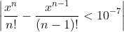

## [Problem 1](1/1.cpp)
> 求e^x的值，要求:</br>


> 已知：</br>

## [Problem 2](2/2.cpp)
> 编写一个递归函数，其功能为：输入一个字符串，字符间都有空格，输出一个整型值。</br>
> 样例输入：

```
1 x 2 y z 3 d h 4 g 5
```
> 样例输出:

```
54321
```

## [Problem 3](3.cpp)
> 使用随机数函数srand()和time()生成随机数，来模拟掷骰子。</br>
> （1）分别投掷两次，将两次所得的值，求出其和值，并写入二维数组A，将数组的行存放第一次投掷的结果，数组的列存放第二次投掷的结果。</br>
> （2）如果投掷1000次，将其和值出现的次数写入二维数组B。</br>
> （这个题目有点奇怪，让人不好理解，我自行作答了）
## [Problem 4](4.cpp)
> 编写FindRepStr()函数，此函数功能为，在字符串str中查找目的字符串findStr, 并用replaceStr来替换，最后输出替换后的字符串str，函数原型如下：

```
void findRepStr(char str[], const char findStr[], const char replaceStr[]);
```
## Problem 5
## [main](5/main.cpp)|[Date.h](5/Date.h)|[Date.cpp](5/Date.cpp)|[Teacher.h](5/Teacher.h)|[Teacher.cpp](Teacher.cpp)
> 编写一个Teacher类，要求类含有教师编号、姓名、性别、出生年月、入职年月，以及以下的成员函数:</br>
> （1）带有默认参数的构造函数（默认出生年月为1900-1-1），复制构造函数。</br>
> （2）2016年进行新一轮聘用，男教师满55岁，女教师满60岁，则到退休年龄，编写函数输出应退休的教师姓名和编号。</br>
> （3）如果满退休年龄的女教师入职时间未满35年，则继续聘用，编写函数输出应继续聘用的满退休年龄的女教师的姓名和编号。</br>
> （4）编写main函数来测试你所设计的类。


题目参考自：https://blog.csdn.net/qq_32925781/article/details/79420284